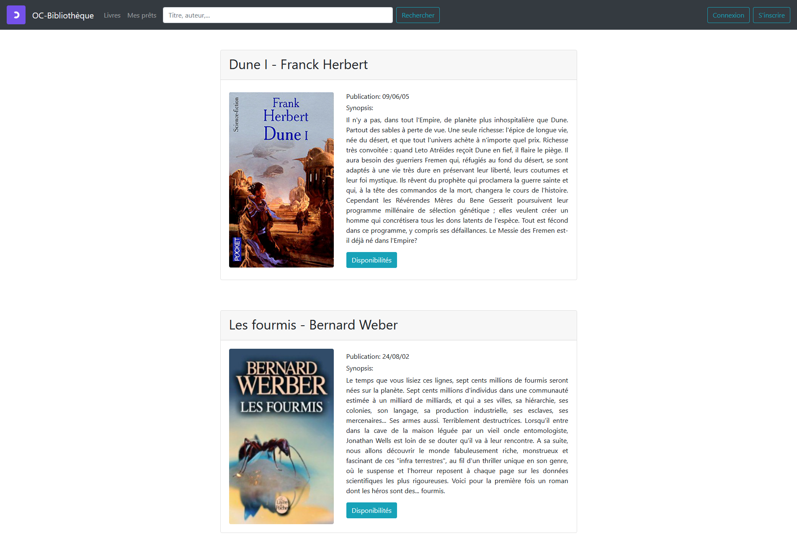

# OC-Bibliothèque

## Présentation

OC-Bibliothèque est un site web dédié aux usagers du réseau de bibliothèques du même nom, cette application web JEE a été réalisée dans le cadre du parcours Développeur d'application Java de la plateforme d'enseignement OpenClassrooms.

Les compétences évaluées sont les suivantes:

* Concevoir une application web avec une approche par composants
* Respecter les bonnes pratiques de développement en vigueur
* Créer une API web avec un microservice REST
* Sélectionner les langages de programmation adaptés pour le développement de l’application
* Interagir avec des composants externes

Les fonctions suivantes sont implémentées:

* Rechercher des ouvrages et voir le nombre d’exemplaires disponibles.
* Permettre aux usagers de consulter leurs prêts en cours. Les prêts sont pour une période de 4 semaines.
* Prolonger un prêt en cours. Le prêt d’un ouvrage n’est prolongeable qu’une seule fois. La prolongation ajoute une nouvelle période de prêt (4 semaines) à la période initiale.
* Inscription via un formulaire
* Login via un formulaire

## Guide de démarrage

### Prérequis

* _PostgreSQL_, système de gestion de base de données, disponible [ici](https://www.postgresql.org/download/).  
* _pgAdmin_, outil d'administration de PostgreSQL, disponible [ici](https://www.pgadmin.org/download/).
* _Maven_, outil de gestion et d'automatisation de production des projets logiciels, disponible [ici](https://maven.apache.org/download.cgi)
* Le répertoire du projet, disponible [ici]()

### Démarrage

#### API

##### I. Paramètrage de la connexion à la base de données

 1. Ouvrir le répertoire du projet OC-Bibliothèque.
 2. Dans le dossier _/api/src/main/resources_, ouvrir le fichier **application.properties**.
 3. Complétez les champs suivants, avec les données de connexion relatives à votre base de données PostgreSQL.

 ```properties
spring.datasource.url=jdbc:postgresql://localhost:5432/OC_bibliotheque
spring.datasource.username=postgres
spring.datasource.password=azerty
```

 4. Enregitrez et fermez le fichier.

##### II. Lancement de l'API

 1. Ouvrir un terminal à l'emplacement du répertoire du projet OC-Bibliothèque
 2. Allez dans le dossier /api
 3. Executer la commande:

 ```terminal
 mvn spring-boot:run
 ```

##### III. Import des données de démo

À l'aide de pgAdmin, éxécuter le script sql _data_demo.sql_.

Ce fichier se trouve dans le répertoire /database

#### Webapp

##### Lancement de la webapp

 1. Ouvrir un terminal à l'emplacement du répertoire du projet OC-Bibliothèque
 2. Allez dans le dossier /webapp
 3. Executer la commande:

 ```terminal
 mvn spring-boot:run
 ```

 4. Ouvrez un navigateur internet rendez vous à l'adresse suivante : _<https://localhost:9002>_

#### Batch

##### Lancement du batch

 1. Ouvrir un terminal à l'emplacement du répertoire du projet OC-Bibliothèque
 2. Allez dans le dossier /batch
 3. Executer la commande:

 ```terminal
 mvn spring-boot:run
 ```

## Technologies utilisées

* JEE
* Spring
  * Spring Boot
  * Spring Data JPA
  * Spring Security
  * Spring MVC
* Rest
* OpenFeign
* Swagger
* Thymleaf
* SSl
* Bootstrap
* Maven

## Aperçu du site



## Auteur

* **Charles Cathala** - [ccathala](https://gist.github.com/ccathala)
